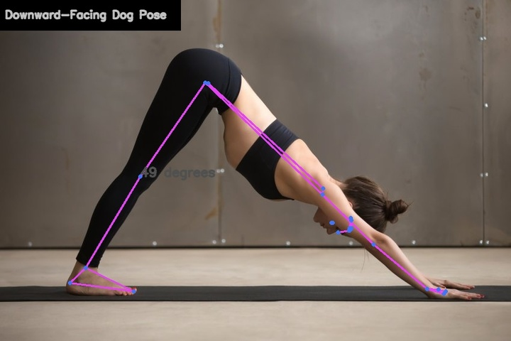
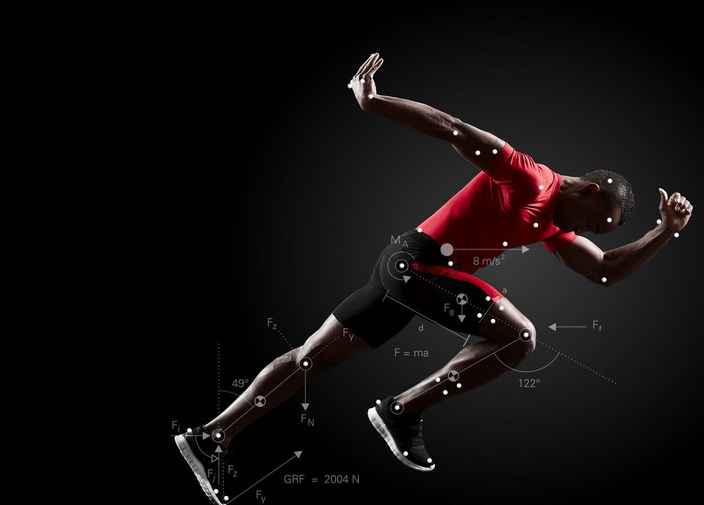
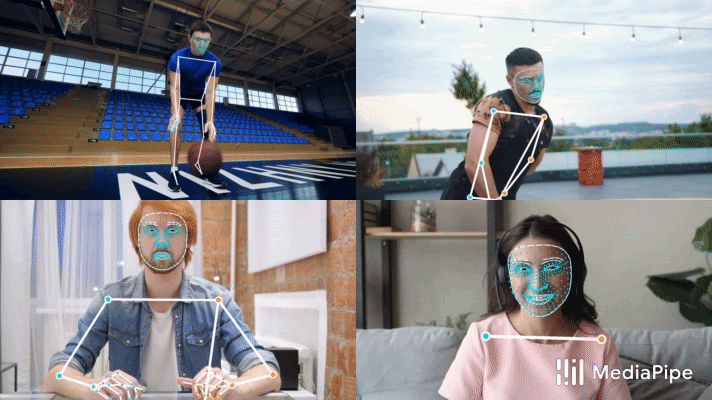
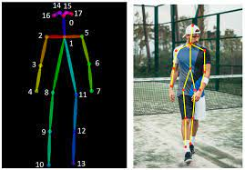
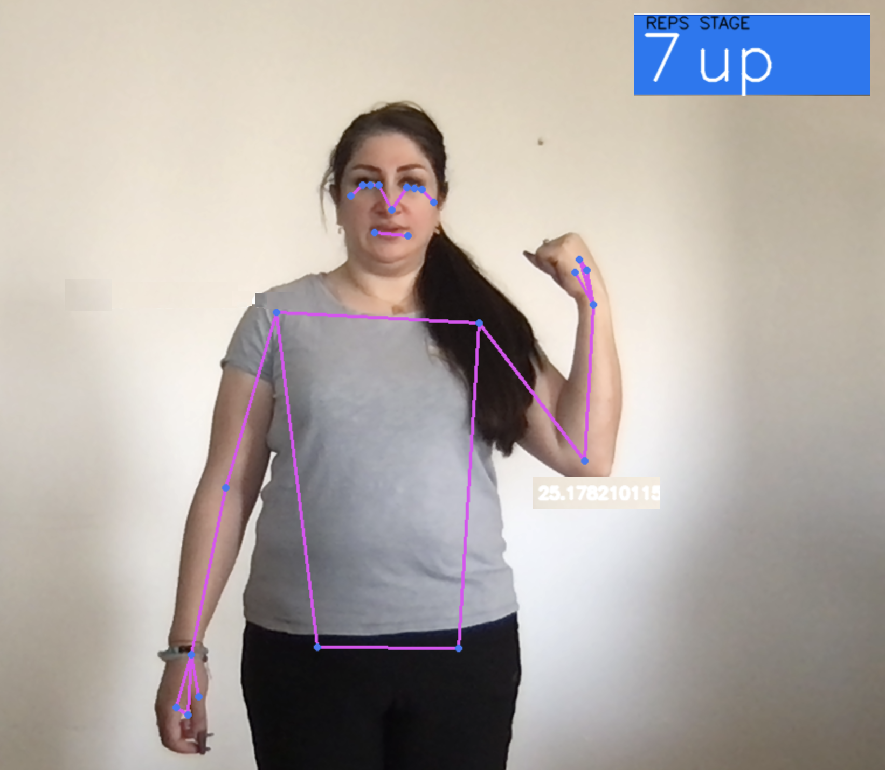
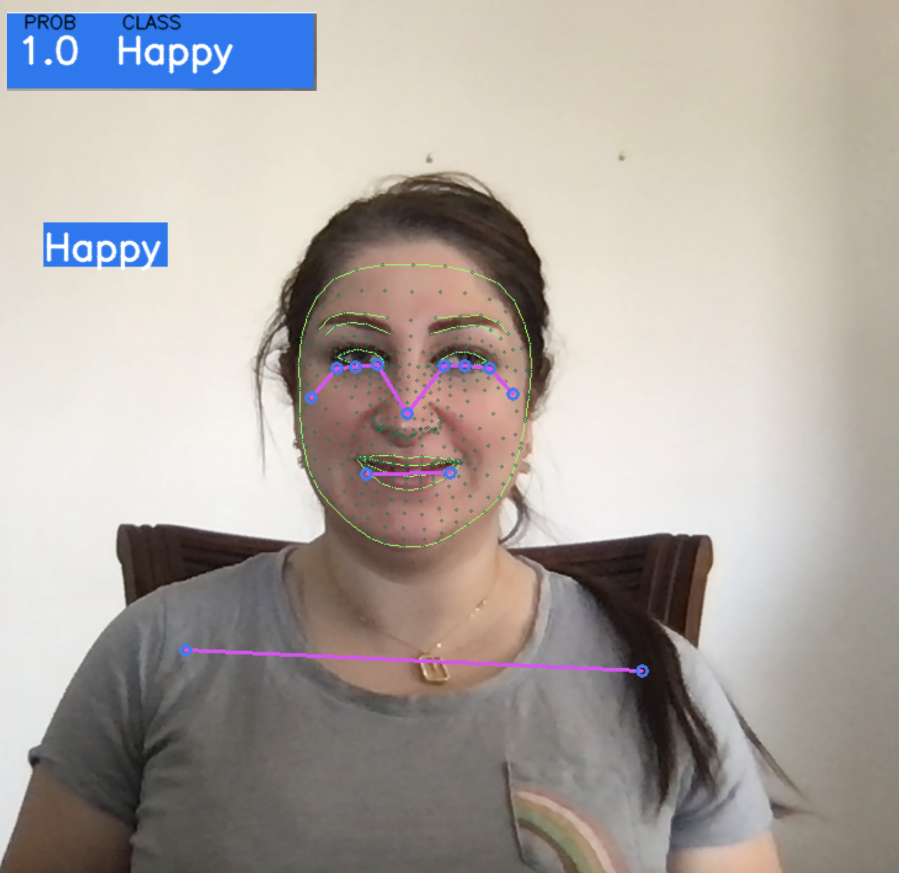
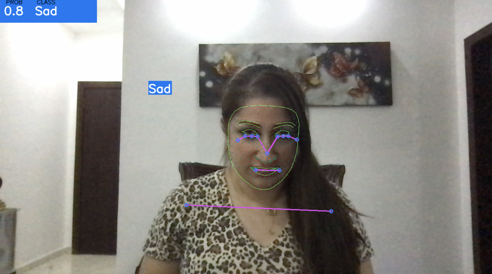
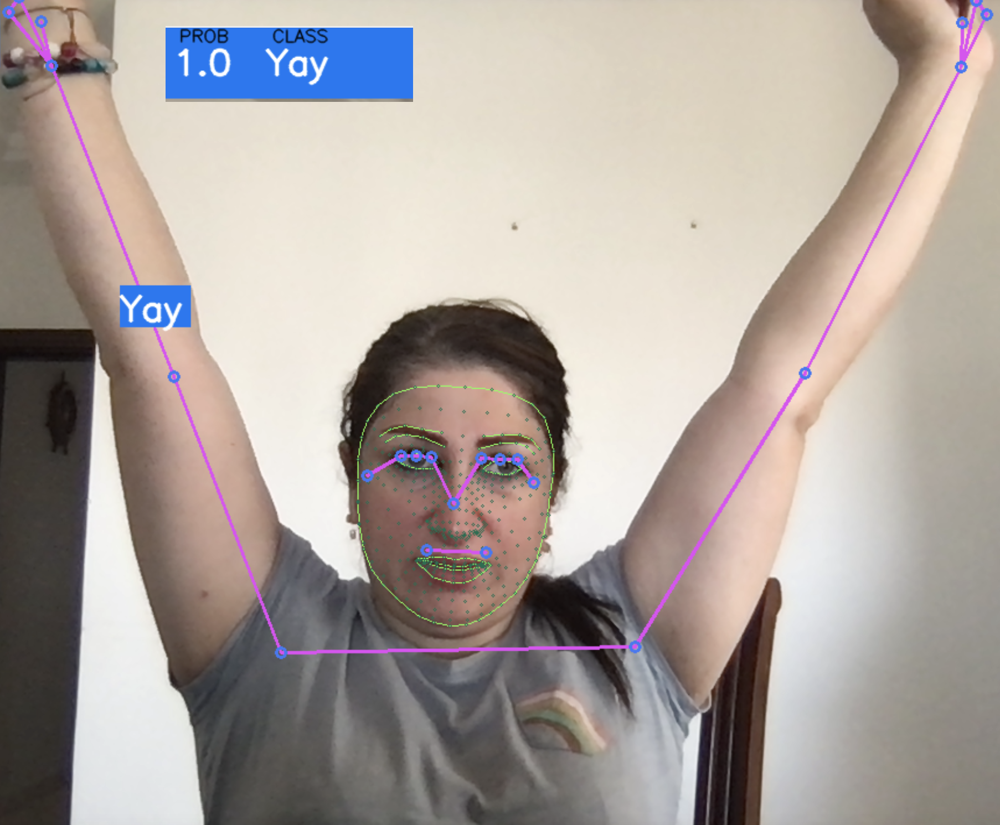

# Pose estimation applications

----
## Marwah Faraj 
Data Scientist\ Computer Scientist

[Linkedin](https://www.linkedin.com/in/marwah-faraj) | [Github](https://github.com/marwahfaraj) | [E-mail](marwah.faraj777@gmail.com) |
[Poject Presentation](https://docs.google.com/presentation/d/1S1Xb8fBqKUNDb3xKsfco8Vzp-51XqJ6JUad1r48WnaU/edit?usp=sharing)
----
# Table of Contents
1. [About Mediapipe](#about-mediapipe)   
2. [Use Case](#use-case)
3. [The Challenges](#the-challenges)
4. [The Process](#the-process)
5. [The Result](#the-result)
6. [Demonstrate the Pose Estimation](#demonstrate-the-pose-estimation)
   - [Exercise Repetitions Counter](#exercise-repetitions-counter)
   - [Emotion Prediction](#emotion-prediction)

8. [Machine learning](#machine-learning)
9. [Conclusions and Further Study](#conclusions-and-further-study)

## ABOUT Mediapipe
It use BlazePose, a lightweight convolutional neural network architecture for human pose estimation that is tailored for real-time inference on computer or mobile devices. 

----
## Use Case
- Activity recognition.
- Motion Capture and Augmented Reality.
- Training Robots.
- Motion Tracking for Consoles. 

## The challenges
Human pose estimation is a challenging task as the body’s appearance joins changes dynamically due to diverse forms of clothes, arbitrary occlusion, occlusions due to the viewing angle, and background contexts.
Therefore, it is challenging for image processing models to identify the fine-grained joint coordinates. It is especially difficult to track small and barely visible joints.

----
## The process
Pose estimation utilizes pose and orientation to predict and track the location of a person or object. Accordingly, pose estimation allows programs to estimate spatial positions (“poses”) of a body in an image or video.
Pose estimation operates by finding key points of a person or object. Taking a person, for example, the key points would be joints like the elbow, knees, wrists, etc. There are two types of pose estimation: multi pose and single pose. Single pose estimation is used to estimate the poses of a single object in a given scene, while multi-pose estimation is used when detecting poses for multiple objects. 

----
## The result
The BlazePose landmark model predicts the location of 33 pose landmarks. 

## Demonstrate the Pose Estimation
### Exercise Repetitions Counter
After predictions the body joint could count the exercise repetitions and use text to speech to tell my how much repetitions I accomplish. 

### Emotion Prediction
The data set collected using the webcam to capture real time emotions and then I train several models like: Logistic Regression algorithm, Ridge Classifier algorithm, Random Forest algorithm, and Gradient Boosting Classifier, and good really good accuracy from all of them. The Model predicted the emotion in reall time sesuccfully which they are Happy, Sad, and Yay. 

----
## Machine Learning
Diffrient machine learning algorithms implemented and used to predict on reall time emotions to classify the emotions and give diffrint scores as detailed below: 
1- LogisticRegression:
  Accuracy= 1.0 

2- Ridge Classifier: 
   Accuracy= 1.0
    
3- Random Foreset Algorthim: 
     Accuracy= 1.0
     
4- GradientBoostingClassifier: 
    Accuracy= 0.998 
  

----
## Conclusions
- I achieved single pose estimation with Mediapipe.

----
## Further study
- Add additional “features” such as face similarity in order to identify the person.
- Deploy the model for emotion detection using AWS.

## Tools used

