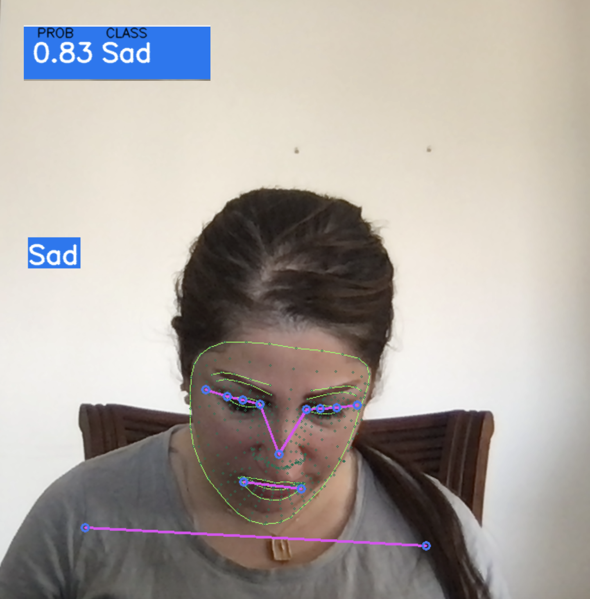

# Pose Estimation Applications

---

## Marwah Faraj
Data Scientist | Computer Scientist

[LinkedIn](https://www.linkedin.com/in/marwah-faraj) | [GitHub](https://github.com/marwahfaraj) | [Email](mailto:marwah.faraj777@gmail.com)

[Project Presentation](https://docs.google.com/presentation/d/1S1Xb8fBqKUNDb3xKsfco8Vzp-51XqJ6JUad1r48WnaU/edit?usp=sharing)

---

# Table of Contents
1. [About Mediapipe](#about-mediapipe)   
2. [Use Case](#use-case)
3. [Challenges](#challenges)
4. [Process](#process)
5. [Result](#result)
6. [Demonstrate Pose Estimation](#demonstrate-pose-estimation)
   - [Exercise Repetitions Counter](#exercise-repetitions-counter)
   - [Emotion Prediction](#emotion-prediction)
7. [Machine Learning](#machine-learning)
8. [Conclusions](#conclusions)
9. [Further Study](#further-study)

## About Mediapipe
Mediapipe utilizes BlazePose, a lightweight convolutional neural network architecture for real-time human pose estimation on computer or mobile devices.

---

## Use Case
- Activity recognition
- Motion capture and augmented reality
- Training robots
- Motion tracking for consoles

## Challenges
Human pose estimation faces challenges such as dynamic changes in appearance, occlusion, and background variations, making it difficult for image processing models to identify fine-grained joint coordinates.

---

## Process
Pose estimation predicts and tracks spatial positions of a body or object by identifying key points such as joints. Two types include single and multi-pose estimation.

---

## Result
BlazePose landmark model predicts 33 pose landmarks.

## Demonstrate Pose Estimation

### Exercise Repetitions Counter
Predicted body joints count exercise repetitions and provide audio feedback.

### Emotion Prediction
Real-time webcam data used to train models (Logistic Regression, Ridge Classifier, Random Forest, Gradient Boosting) for emotion prediction (Happy, Sad, Yay).

---

## Machine Learning
Various machine learning algorithms implemented to classify real-time emotions with high accuracy:
1. Logistic Regression: Accuracy = 1.0
2. Ridge Classifier: Accuracy = 1.0
3. Random Forest Algorithm: Accuracy = 1.0
4. Gradient Boosting Classifier: Accuracy = 0.998

---

## Conclusions
The tool enables users to track workout repetitions automatically, improving convenience during exercise routines.

---

## Further Study
- Expand exercise repertoire to include yoga poses.
- Integrate additional features like face recognition for identifying users.
- Deploy emotion prediction model using AWS.

## Tools Used

